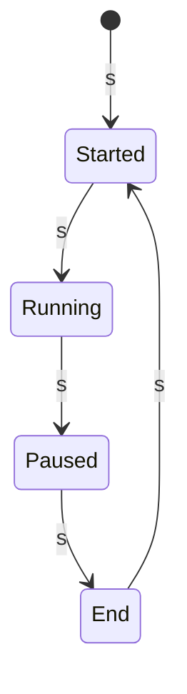
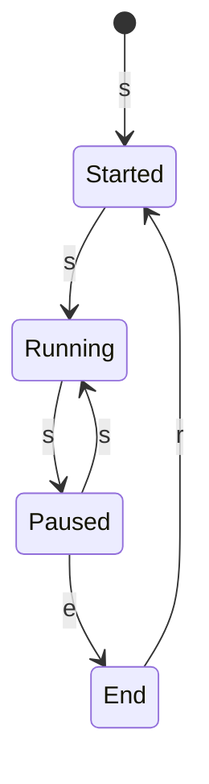

# To-Do List

## ✏️ Work Tasks
- [x] Compute a score of ball follow
- [x] Display the score
- [x] Mouse control input
- [ ] Add a new trajectory
- [ ] Complete Readme to describe how app works plus trajectory implemented
- [x] fixed y dimension in mouse control
- [ ] Timer
- [ ] write res in a file to plot it
- [ ] reset the game
- [ ] fix score seems too big
- [ ] fix state machine
- [ ] tune the score metrics, maybe change it 

## 📝 Notes
- State machine of RunningState : 

wanted StateMachine

