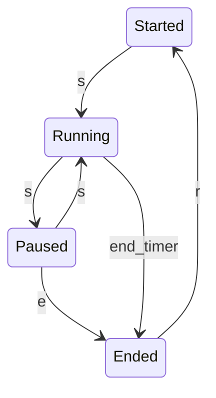

# Games states transition machine
The game operates within four primary states:

1. **Started**:
   - This is the initial state where the game is set up and awaiting user input to start running.

2. **Running**:
   - In this state, the game is actively processing its logic, managing events, and updating the game world.

3. **Paused**:
   - The game's logic is temporarily halted in this state. No updates are processed until the game is resumed.

4. **Ended**:
   - This final state occurs when the game has concluded, and the player's score is calculated and displayed.

These states dictate how the game flows, with transitions occurring based on user inputs or game events.

There are four key events that trigger state transitions:

- **KeyS pressed (`s`)**: Starts or resumes the game.
- **KeyE pressed (`e`)**: Ends the game when pressed.
- **End of a timer (`end_timer`)**: Automatically ends the game after a specified duration (X seconds).
- **KeyR pressed (`r`)**: Resets the game, returning it to the initial state.

