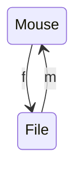

# Games states transition machine
The systems is constrained by some state machine that control the : 
   - **Game state** : The games is paused, running or started
   - **Controller state** : The game is controlled by a mouse, a file with cmd in it   
## 1. Game states
The game operates within four primary states:

1. **Started**:
   - This is the initial state where the game is set up and awaiting user input to start running.

2. **Running**:
   - In this state, the game is actively processing its logic, managing events, and updating the game world.

3. **Paused**:
   - The game's logic is temporarily halted in this state. No updates are processed until the game is resumed.

4. **Ended**:
   - This final state occurs when the game has concluded, and the player's score is calculated and displayed.

These states dictate how the game flows, with transitions occurring based on user inputs or game events.

There are four key events that trigger state transitions:

- **KeyS pressed (`s`)**: Starts or resumes the game.
- **KeyE pressed (`e`)**: Ends the game when pressed.
- **End of a timer (`end_timer`)**: Automatically ends the game after a specified duration (X seconds).
- **KeyR pressed (`r`)**: Resets the game, returning it to the initial state.


## 2. Controller state

To change the controller of the games you need to be in the **Started** game state, and press the key "f" or "m".


# environment Control

TBD yet #TODO
the environment is controlled by a controller (mouse) movement and take in input delta_x wich move the player as $x_{t+1} = dx + x_t$
```

        ┌─────────────┐  ball trajectory
        │             ├───────►         
        │             │                 
dx      │             │                 
 ──────►│             │                 
        │ environment │                 
        │             │                 
        │             │  player distance
        │             ├───────►         
        │             │                 
        └─────────────┘                 
```

# Trajectory 
## 1. deterministic trajectory
the ball folow a straight line with an initial direction going rightward, the direction goes to rightward to leftward when the ball reach the window's right bounds, the direction change every times the ball reach a window's bounds

# Rewards / Score

## 1. gaussian
The score is calculated using a Gaussian distribution, as defined by the following formula:

$$
\text{Score} = e^{-\frac{(x_f - x_p)^2}{\text{STD\_SCORE}}}
$$

Where:
- \( x_f \) is the final value,
- \( x_p \) is the predicted value,
- \(\text{STD\_SCORE}\) represents the standard deviation.

The maximum possible score is calculated as:

$$
\text{Maximum Score} = 0.01 \times 10 \, \text{seconds} = 1000.0
$$

<div style="text-align: center;">
    
</div>

## 2. square 

The score is calculated using a square signal of the distance, if the distance is less or equal to PIXEL_DIST_METRIC then it is equals to 1.0 either way it's equals to 0.0

The maximum possible score is calculated as:

$$
\text{Maximum Score} = 0.01 \times 10 \, \text{seconds} = 1000.0
$$

<div style="text-align: center;">
    
</div>

# log part 

the log file is organized as follow : 
| **Ball's Position (x, y)** | **Player's Position (x, y)** | **Mouse Movement (dx, dy)** | **Score** | **Time** |
|----------------------------|-----------------------------|-----------------------------|-----------|----------|
| (150, 200)                 | (120, 180)                  | (20, 10)                    | 10        | 00:15    |
| (300, 400)                 | (280, 370)                  | (30, 15)                    | 20        | 00:30    |
| (450, 600)                 | (420, 570)                  | (30, 20)                    | 30        | 00:45    |
| (600, 800)                 | (580, 770)                  | (20, 30)                    | 40        | 01:00    |

where each Position and movement contain a 2D variable for x and y component.

# Networking

## state machine

in started state, you can decide to use networks option, this option allow the communication of the game with other software, the game publish on a topic **GameData/** related data : 
| **Ball's Position (x, y)** | **Player's Position (x, y)** | **Mouse Movement (dx, dy)** | **Score** | **Time** |
|----------------------------|-----------------------------|-----------------------------|-----------|----------|

## To allow connection 
to allow connection press **n** on started state, the connection is done through the mean of a pub sub pattern 

